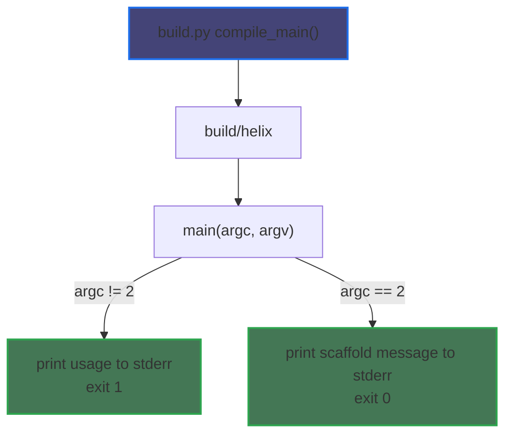

# C++ Implementation: Current State

## Summary

The C++ runtime is still a scaffold. The binary builds, the public header surface exists, and `build.py` can compile and invoke the native executable, but the cell-based evaluation model described in `README.md` is not implemented natively yet. In particular, there is not yet a native realization of the two central operations, `find` and `eval`, and there is not yet a running VM whose execution state is embedded into the same graph it evaluates.

## Build Entry

- `python3 build.py build`
- output executable: `build/helix`

Compiled translation units:

- `src/helix.cpp`
- `src/core.cpp`
- `src/builtins.cpp`
- `src/utils.cpp`
- `src/ryml_interface.cpp`

## Actual Invocation Graph

Only one runtime path currently exists:

```text
build.py
└── compile_main()
    ├── compile src/helix.cpp
    ├── compile src/core.cpp
    ├── compile src/builtins.cpp
    ├── compile src/utils.cpp
    ├── compile src/ryml_interface.cpp
    └── link build/helix

build/helix <program.yaml>
└── main(argc, argv)
    ├── if argc != 2
    │   └── print usage to stderr and exit 1
    └── otherwise
        └── print "C++ runtime scaffold not implemented yet: <path>" to stderr and exit 0
```

There are no native calls yet from `main()` into parsing, evaluation, builtin dispatch, or serialization.



## Declared Native Surface

The headers describe the intended modules, even though the `.cpp` implementations are still empty. They should be read as declarations of a future cell-oriented runtime, not as evidence that the runtime semantics already exist.

### `include/runtime.hpp`

Declares the core data model:

- `Scalar`
- `Value`
- `Signal`
- `Frame`
- `Program`
- `VM`

Current control-state shape:

- `Signal::Kind`: `none`, `error`, `returning`
- `VM::Status`: `ready`, `running`, `finished`, `failed`

This is only a placeholder approximation of the runtime model in the README. It does not yet express the stronger claim that the VM/environment/execution state collapse into one graph of cells, and it does not yet implement `find(vm, key)` or `eval(vm)` as the system’s governing operations.

### `include/core.hpp`

Declares:

- `class Evaluator`
- `Value evaluate(const Value&, Program&)`
- `Value evaluate_node(string_view, Program&)`

### `include/builtins.hpp`

Declares:

- `BuiltinArguments`
- `BuiltinImplementation`
- `class BuiltinRegistry`
- `BuiltinRegistry create_default_builtins()`

### `include/ryml_interface.hpp`

Declares:

- `class YamlInterface`
- `load_program`
- `load_program_file`
- `dump_program`
- `dump_vm`

### `include/utils.hpp`

Declares:

- `to_string(const Value&)`
- `to_string(const Signal&)`
- `to_string(VM::Status)`

## Status By Translation Unit

- `src/helix.cpp`: only `main()` exists
- `src/core.cpp`: empty stub
- `src/builtins.cpp`: empty stub
- `src/utils.cpp`: empty stub
- `src/ryml_interface.cpp`: empty stub

## Practical Consequence

The current native runtime can be built and launched, but it cannot yet:

- model the README’s unified cell graph directly
- implement `find`-driven name resolution
- parse YAML programs
- evaluate nodes or expressions
- dispatch builtins
- produce final VM YAML
- pass the semantic fixture suite used by the Racket runtime
