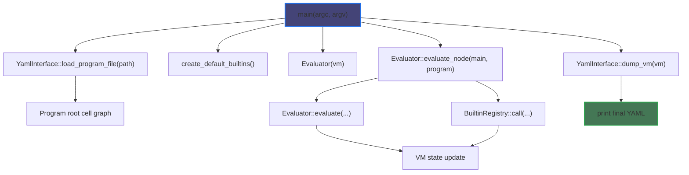
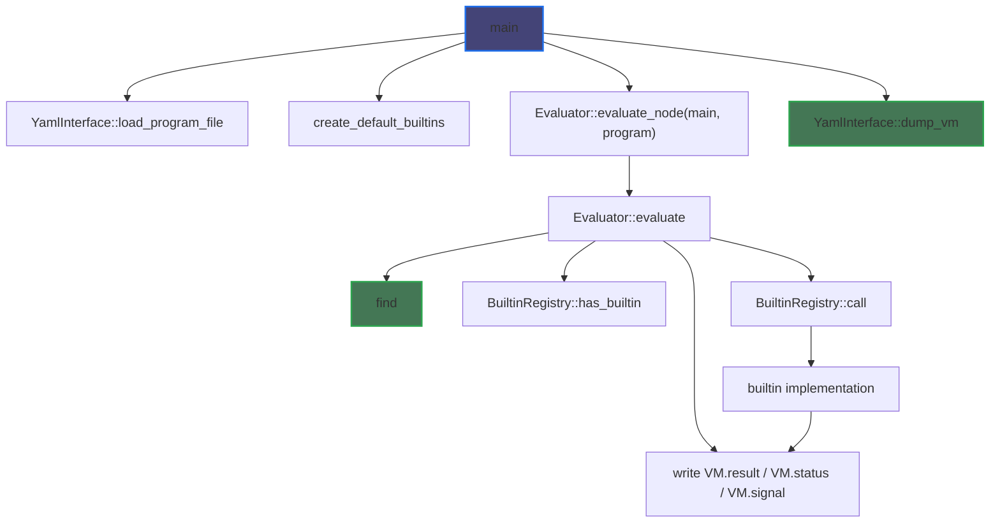

# C++ Implementation: Planned State

## Goal

The native runtime should become the primary implementation of Helix. It should execute the existing YAML program format, match current Racket behavior where that behavior is already tested, and preserve the philosophy described in `README.md`: the language is cell-based, the root program is a graph, and execution is organized around `find` and `eval` rather than around a large number of special runtime categories.

## Planned Runtime Flow

```
build/helix <program.yaml>
└── main(argc, argv)
    ├── validate CLI arguments
    ├── YamlInterface::load_program_file(path)
    │   └── parse YAML into Program
    ├── create VM
    ├── create BuiltinRegistry
    │   └── create_default_builtins()
    ├── create Evaluator
    ├── Evaluator::evaluate_node("main", program)
    │   ├── evaluate expressions
    │   ├── dispatch builtins
    │   ├── update VM frames/status/result
    │   └── propagate active Signal state
    ├── YamlInterface::dump_vm(vm)
    └── print final YAML result
```



## Planned Semantic Commitments

The C++ rewrite should preserve these core ideas from `README.md`:

- the cell is the fundamental runtime entity
- the program root is the execution root
- name resolution is structural and should be expressible as `find`
- execution is driven by `eval`
- execution state should remain conceptually local to the graph being executed, even if some helper C++ types are used to represent it

The implementation may use ordinary C++ structs and helper classes, but those should serve the cell model rather than replace it conceptually.

## Planned Module Responsibilities

### `runtime.hpp`

Own the shared runtime model:

- value representation
- program representation
- VM state
- signal/control-state representation
- frame-local state

The central invariant should be:

- values are ordinary data
- signals represent active non-local control
- VM owns execution status

More specifically, this layer should evolve toward the README’s stronger model:

- cells are maps or sequences in the YAML-derived graph
- references are resolved structurally
- execution context should be recoverable from the graph rather than hidden behind unrelated global state

### `ryml_interface.cpp`

Own YAML translation only:

- parse fixture/program YAML into `Program`
- serialize final VM state back to YAML
- avoid evaluation policy

This file should not decide runtime semantics.

### `core.cpp`

Own evaluation semantics:

- implement `find`
- implement `eval`
- evaluate literals
- evaluate symbol/node references
- evaluate lists/forms
- sequence subexpression evaluation
- short-circuit when `VM` enters a signaled state
- resolve the top-level result

This should become the main semantic center of the runtime.

### `builtins.cpp`

Own builtin registration and builtin behavior:

- arithmetic builtins
- `set`
- `show`
- `list`
- `eval`
- `include`
- `start`
- `step`
- future control builtins such as `return`

Builtin code should be narrow and rely on evaluator helpers instead of duplicating sequencing logic.

### `utils.cpp`

Own conversion helpers and diagnostics:

- stringification of values
- stringification of signals
- stringification of VM status

## Planned Invocation Graph

```
main
├── YamlInterface::load_program_file
│   └── Program
├── create_default_builtins
│   └── BuiltinRegistry
├── Evaluator(vm)
├── Evaluator::evaluate_node("main", program)
│   ├── Evaluator::evaluate(...)
│   │   ├── literal handling
│   │   ├── reference lookup
│   │   └── form dispatch
│   ├── BuiltinRegistry::has_builtin(...)
│   ├── BuiltinRegistry::call(...)
│   │   └── builtin implementation
│   │       ├── update Program or VM
│   │       ├── return Value
│   │       └── optionally activate Signal
│   └── write VM.result / VM.status
└── YamlInterface::dump_vm(vm)
```



## Planned Control-Flow Model

The native runtime should separate data from active control:

- `Value` is ordinary language data
- `Signal` is active runtime control state
- `VM` carries the active signal and final status

That supports:

- ordinary success
- errors
- `return`
- later `break` and `continue`

without forcing every interface to treat control transfers as ordinary values.

This is consistent with the README’s philosophy so long as the separation is understood as an implementation aid. Conceptually, the runtime still executes one cell graph. The helper C++ types should clarify that process, not fragment it into unrelated conceptual layers.

## Planned Testing Path

`build.py` should remain the single entrypoint:

- `python3 build.py build`
- `python3 build.py cpp-test`
- `python3 build.py racket-test`

Expected development loop:

1. add or refine YAML fixtures in `tests/`
2. verify behavior against the Racket runtime
3. implement matching native behavior
4. run the same fixtures against the C++ runtime

## Planned Near-Term Milestones

1. Implement `YamlInterface::load_program_file` and final-state serialization.
2. Implement a minimal `Evaluator` that can run a `main` node with literals and references.
3. Implement builtin registration plus the smallest tested builtin subset.
4. Make `cpp-test` pass the first semantic fixtures.
5. Extend the evaluator with signal-aware control flow rather than encoding control as ordinary values.
