The Helix programming system is mainly inspired by Smalltalk and defines a language where the only runtime entity is a cell, and every cell is structurally a map. There are no distinct runtime categories such as function, environment, object, or VM. Instead, these roles emerge from behavior. The entire program is represented as a single root cell, and execution begins by locating an `"eval"` entrypoint within that structure. From that point forward, all computation proceeds through two operations: `find` and `eval`. `find(vm, key)` performs name resolution relative to a given execution context, while `eval(vm)` executes a cell within that same context. The crucial simplification is that the environment and the VM are identical. There is no separation between lexical scope, dynamic scope, and execution state; all of it lives inside the same graph of cells.

Name resolution is purely structural. A cell may contain arbitrary keys, but if a key is not found locally, `find` follows a `"parent"` reference, recursively. This creates a prototype-like delegation chain that simultaneously models lexical scope and inheritance. No special environment object exists. Any cell can serve as a scope simply by participating in this delegation chain. Because `find` is the only mechanism for retrieving data, it becomes the backbone of all symbolic reference. A string is not just a primitive value; it is a potential reference. When a `StrCell` is evaluated, it resolves its contents via `find`, turning strings into symbolic links within the program graph. This eliminates the need for a separate symbol type and aligns the surface representation directly with runtime behavior.

Evaluation is driven by polymorphism on cell type. There is no global interpreter loop that distinguishes expressions from values. Instead, each cell defines how it evaluates itself. A `VecCell` encodes structured computation using a rule analogous to Lisp: the first element is treated as the actor, and the remaining elements are arguments. Evaluation proceeds by evaluating the actor, then invoking it with arguments derived from the vector tail. However, unlike traditional Lisp, arguments are not passed explicitly through function calls. Instead, they are implicitly managed through VM state. The `eval(vm)` method of each cell reads from and writes to this shared state, typically a stack or frame structure stored under a `"state"` field accessible via `find`. This means that argument passing, return values, and control flow are all mediated through mutation of the VM’s internal data rather than through function parameters.

This design choice pushes the system toward a stack-based execution model without introducing a separate instruction set or bytecode. Each cell acts as a reduction rule that transforms VM state. A `VecCell` might push intermediate results onto the stack, invoke another cell, and then consume results. A callable cell might pop its arguments from the stack, perform computation, and push a result. Because `eval` is the only operation that mutates state, it becomes the locus of all computational effect. In contrast, `find` remains purely observational, traversing structure without side effects. This separation is intentional. It enforces a clear boundary between reading the program graph and executing it, even though both operations operate over the same unified data structure.

The absence of explicit argument passing has significant implications. It removes the need for a fixed calling convention at the interface level, allowing different cells to interpret the stack in different ways. One cell might treat the top of the stack as its argument list, while another might use a frame pointer stored in `"state"`. This flexibility enables multiple execution strategies to coexist within the same system. At the same time, it introduces implicit data flow, which must be carefully managed. The system relies on convention rather than enforcement: cells must agree on how the stack is structured at call boundaries. This is a deliberate tradeoff. It sacrifices some local clarity in exchange for global uniformity and extensibility.

A key property of the system is that any cell can act as a micro-VM. If a cell defines a `"state"` field and implements `eval` in terms of that state, it can host its own execution process. This allows for nested interpreters, coroutines, or isolated execution contexts without introducing new primitives. For example, a cell could contain its own stack and frames, and its `eval` method could interpret a subgraph of cells independently of the outer VM. Because `find` always operates relative to the current VM, switching execution contexts is as simple as changing which cell is passed as `vm`. This makes control flow highly composable. Execution is not centralized but distributed across cells that locally manage their own state and semantics.

Error handling is integrated into the object model. Errors are represented as cells, not as exceptions or out-of-band signals. When an operation fails, it returns an error cell. Subsequent `find` or `eval` operations on that cell propagate the error. This ensures that failure is handled uniformly within the same mechanism as all other computation. There is no need for special control constructs for error propagation; it emerges naturally from polymorphism. This approach also allows errors to carry structured information and participate in the same delegation and evaluation mechanisms as any other cell.

The introduction of `return` creates a more subtle problem. A returned value is ordinary data, but the act of returning is not. If `return` is modeled as just another normal value, then every caller of `eval` must inspect the result to determine whether evaluation produced data or a non-local control transfer. That forces control-flow checks into every sequencing site, every builtin that evaluates subexpressions, and every future evaluator helper. In a system whose semantics are intentionally concentrated around `find` and `eval`, this is a bad distortion. It spreads one control-flow concern across the entire runtime and weakens the uniformity that the cell model is meant to provide.

The planned solution is to introduce `Signal` as a parent cell type for non-local control outcomes, with `Error` and `Return` as sibling signal cells. This keeps the representation object-oriented and Smalltalk-like: signals remain inspectable cells within the language, rather than hidden host-language exceptions. At the same time, the runtime will distinguish between a signal cell as an object and an actively signaled condition in the VM. A `Return` cell can therefore exist as structured data, but when `return` is evaluated in control position it activates a return signal in VM state. Evaluation then unwinds until the appropriate function boundary consumes that signal, just as an active error signal propagates until it is handled or reaches the top level.

This separation is necessary because the language needs both reification and non-local transfer. Reification matters because cells are the only runtime entities, so errors and returns should be representable, inspectable, and composable as cells. Non-local transfer matters because `return` is not merely a value constructor; it is a request to stop the current evaluation path. A unified `Signal` family solves both requirements at once. It preserves the single-cell ontology, gives `Error` and `Return` a common abstraction, and centralizes propagation in VM control state rather than forcing every builtin and every caller of `eval` to manually thread a tagged union through ordinary value flow.

The system’s use of a map-based representation aligns naturally with using a data serialization format such as YAML as the surface syntax. Programs can be written directly as YAML documents, which parse into the same map and vector structures used at runtime. This eliminates the need for a custom parser and ensures that the syntax is a direct reflection of the execution model. A YAML sequence becomes a `VecCell`, and a YAML mapping becomes a `MapCell`. Strings become `StrCell` instances that resolve symbolically. This tight correspondence between syntax and semantics reduces the conceptual gap between source code and execution, making the system easier to reason about and manipulate programmatically.

Conceptually, the system sits at the intersection of prototype-based object systems, Lisp-style evaluation, and stack-based virtual machines. From prototype systems, it takes delegation via `"parent"`. From Lisp, it takes the idea that code is data and that structured lists represent computation. From stack machines, it takes implicit argument passing and state-driven execution. However, it does not fully commit to any of these paradigms. Instead, it extracts their minimal operational principles and recombines them into a uniform model centered on cells and two operations. The result is a language where structure, behavior, and execution are all expressed in the same medium, and where complexity arises from composition rather than from a large set of primitives.

## Codebase overview

The diagram below shows the current repository-level invocation graph. Solid edges are unconditional calls in the relevant control path; dotted edges are branch-dependent or optional calls. Root and leaf highlighting is computed within the repository function graph, not including top-level forms or library calls.

```mermaid
flowchart LR
  classDef root fill:#447,stroke:#1f6feb,stroke-width:2px;
  classDef leaf fill:#475,stroke:#2da44e,stroke-width:2px;
  classDef rootleaf fill:#764,stroke:#9a6700,stroke-width:2px;

  subgraph H["helix.rkt"]
    h_remember["remember-vm-source!<br/>tag VM with source dir"]
    h_vm_base["vm-base-directory<br/>read VM source dir"]
    h_load_yaml["load-yaml-file<br/>load YAML from disk"]
    h_load_program["load-program<br/>load and validate root VM"]
    h_load_include["load-include-entry<br/>load include and derive key"]
    h_apply_includes["apply-includes!<br/>merge include files into VM"]
    h_expect_vm["expect-vm<br/>validate VM-shaped mapping"]
    h_ensure_state["ensure-vm-state!<br/>create VM state fields"]
    h_reset_state["reset-vm-state!<br/>clear transient run state"]
    h_initialize["initialize-vm!<br/>prepare VM for execution"]
    h_mark_error["mark-vm-error!<br/>record VM failure state"]
    h_vm_frames["vm-frames<br/>read frame stack"]
    h_set_frames["set-vm-frames!<br/>write frame stack"]
    h_vm_status["vm-status-result<br/>decode terminal VM state"]
    h_finish["finish-vm!<br/>store finished result"]
    h_with_running["with-vm-running-state<br/>run only while active"]
    h_resolve_child["resolve-child-vm<br/>resolve nested VM argument"]
    h_with_child["with-resolved-child-vm<br/>resolve child then continue"]
    h_advance["advance-vm!<br/>run or resume one VM step"]
    h_run["run-vm<br/>drive VM to completion"]
    h_builtin_start["builtin-start<br/>run named child VM"]
    h_builtin_step["builtin-step<br/>step named child VM"]
  end

  subgraph B["builtins.rkt"]
    b_expect_arity["expect-arity<br/>check builtin arity"]
    b_expect_number["expect-number<br/>check numeric value"]
    b_expect_string["expect-string<br/>check string value"]
    b_call_param["call-with-step-parameter<br/>bind step parameter"]
    b_call_resolve["call-with-resolve<br/>bind external builtin hook"]
    b_call_runtime["call-with-step-runtime<br/>bind step runtime"]
    b_call_frame["call-with-step-frame<br/>bind step frame"]
    b_frame_ref["frame-ref<br/>read frame field or default"]
    b_cells_yaml["cells->yaml-string<br/>render VM cells as YAML"]
    b_append_stdout["append-stdout!<br/>append rendered stdout line"]
    b_eval_sequence["evaluate-sequence<br/>run sequence with yields"]
    b_resolve_path["resolve-path<br/>follow dotted path"]
    b_resolve["resolve<br/>resolve builtin or program value"]
    b_evaluate["evaluate<br/>evaluate one node"]
    b_evaluate_list["evaluate-list<br/>dispatch vector actor"]
    b_builtin_add["builtin-add<br/>evaluate and add two numbers"]
    b_builtin_eval["builtin-eval<br/>evaluate evaluated code"]
    b_builtin_list["builtin-list<br/>evaluate sequence value"]
    b_builtin_show["builtin-show<br/>print and preserve value"]
    b_builtin_set["builtin-set<br/>store field in VM"]
    b_builtin_q["builtin?<br/>test builtin membership"]
    b_resolve_builtin["resolve-builtin<br/>bind builtin dispatcher"]
  end

  h_load_program --> h_load_yaml
  h_load_yaml --> h_remember
  h_load_include --> h_load_yaml
  h_apply_includes -.-> h_vm_base
  h_apply_includes -.-> h_load_include
  h_initialize --> h_ensure_state
  h_initialize -.-> h_apply_includes
  h_initialize -.-> h_reset_state
  h_mark_error --> h_ensure_state
  h_vm_frames --> h_ensure_state
  h_set_frames --> h_ensure_state
  h_with_running --> h_ensure_state
  h_with_running --> h_vm_status
  h_resolve_child --> b_expect_arity
  h_resolve_child --> h_expect_vm
  h_resolve_child --> b_resolve
  h_resolve_child --> b_expect_string
  h_resolve_child --> h_remember
  h_resolve_child --> h_vm_base
  h_with_child --> h_resolve_child
  h_advance --> h_expect_vm
  h_advance -.-> h_mark_error
  h_advance --> h_initialize
  h_advance --> h_with_running
  h_advance --> b_call_resolve
  h_advance --> b_call_runtime
  h_advance -.-> h_vm_frames
  h_advance -.-> h_set_frames
  h_advance -.-> b_call_frame
  h_advance -.-> b_evaluate
  h_advance -.-> h_finish
  h_run --> h_expect_vm
  h_run --> h_with_running
  h_run --> h_advance
  h_builtin_start --> h_with_child
  h_builtin_start --> h_run
  h_builtin_step --> h_with_child
  h_builtin_step --> h_advance
  h_builtin_step --> h_ensure_state

  b_call_resolve --> b_call_param
  b_call_runtime --> b_call_param
  b_call_frame --> b_call_param
  b_eval_sequence --> b_frame_ref
  b_eval_sequence --> b_evaluate
  b_resolve -.-> b_resolve_builtin
  b_resolve -.-> b_resolve_path
  b_evaluate -.-> b_resolve
  b_evaluate -.-> b_evaluate_list
  b_evaluate_list --> b_evaluate
  b_builtin_add --> b_expect_arity
  b_builtin_add --> b_evaluate
  b_builtin_add --> b_expect_number
  b_builtin_eval --> b_expect_arity
  b_builtin_eval --> b_evaluate
  b_builtin_list --> b_expect_arity
  b_builtin_list -.-> b_evaluate
  b_builtin_list --> b_frame_ref
  b_builtin_list --> b_eval_sequence
  b_builtin_show --> b_expect_arity
  b_builtin_show --> b_evaluate
  b_builtin_show --> b_cells_yaml
  b_builtin_show --> b_append_stdout
  b_builtin_set --> b_expect_arity
  b_builtin_set --> b_expect_string
  b_builtin_set --> b_evaluate

  class h_load_program,h_builtin_start,h_builtin_step root;
  class h_expect_vm,h_reset_state,h_vm_status,h_finish,b_expect_arity,b_expect_number,b_expect_string,b_frame_ref,b_cells_yaml,b_append_stdout,b_resolve_path,b_resolve_builtin leaf;
  class b_builtin_q rootleaf;
```

## Responsibility matrix

This matrix is intentionally selective. It captures the dominant responsibilities rather than every helper edge.

| Func | Includes | Path | Eval | Steps | Child VM Ctrl |
| --- | --- | --- | --- | --- | --- |
| `apply-includes!`         | x |   |   |   |   |
| `initialize-vm!`          | x |   |   |   |   |
| `resolve-path`            |   | x |   |   |   |
| `resolve`                 |   | x | x |   |   |
| `call-with-resolve`       |   | x |   | x |   |
| `evaluate`                |   |   | x |   |   |
| `evaluate-list`           |   |   | x |   |   |
| `advance-vm!`             |   |   | x | x |   |
| `run-vm`                  |   |   |   | x |   |
| `resolve-child-vm`        |   | x |   |   | x |
| `builtin-start`           |   |   |   | x | x |
| `builtin-step`            |   |   |   | x | x |
| `evaluate-sequence`       |   |   | x | x |   |
| `builtin-eval`            |   |   | x |   |   |
| `builtin-list`            |   |   | x | x |   |
