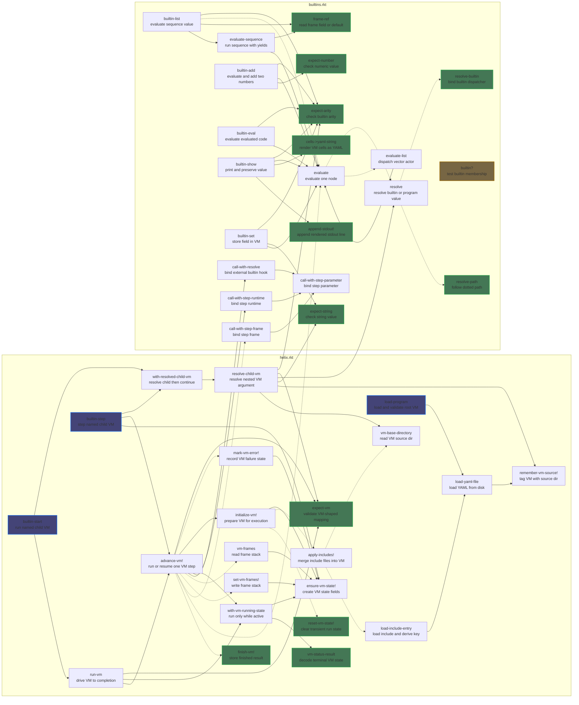

## Overview

The Helix programming system is mainly inspired by Smalltalk, but the current implementation is a Racket prototype over parsed YAML values. In the current runtime, the executable program is a mutable top-level mapping with a required `"main"` entrypoint and a runtime-owned `"state"` field. Strings, lists, mappings, and scalars are interpreted directly through host-language values rather than through a completed C++-style cell class hierarchy.

Even so, the design direction is already visible. Helix is trying to converge on a model where small runtime units behave like cells or Lisp nodes, while larger runtime objects such as a running VM are assembled from those units rather than treated as unrelated machinery.

Execution begins by locating `"main"` inside the top-level program mapping. From that point forward, the current runtime is organized around two operations:

- `find(vm, key)` performs name resolution relative to a given execution context.
- `eval(vm)` executes a cell within that same context.

In the present Racket implementation these operations are realized concretely as the `resolve` and `evaluate` functions, together with a small amount of VM scheduling logic in `helix.rkt`. The crucial simplification is that execution state lives inside the same top-level program object being interpreted rather than in a detached host-side environment.

## Name Resolution

The current name-resolution behavior is simpler than the long-term prototype-style design.

- Builtin names resolve first.
- Then top-level program fields resolve by exact key.
- Dotted names such as `foo.bar` resolve by walking nested mappings from the program root.

There is not yet a general `"parent"`-chain lookup in the Racket runtime. That remains part of the conceptual direction rather than current behavior. Today, symbolic reference is still centralized enough that `resolve` forms the backbone of evaluation.

Strings are therefore not merely primitive values. A `StrCell` can act as a symbolic reference: when evaluated, it resolves its contents through `find`. This removes the need for a separate symbol type and keeps the surface representation aligned with runtime behavior.

## Evaluation Model

The current Racket runtime uses a small centralized evaluator rather than a fully distributed per-cell method system. Concretely:

- strings are resolved through `resolve`
- lists are treated as executable forms
- all other YAML values evaluate to themselves

`VecCell` encodes structured computation using a Lisp-like rule:

- the first element is treated as the actor
- the remaining elements are treated as arguments

The actor must resolve to a builtin procedure. There is not yet a user-defined callable cell protocol in the current runtime. Even so, the evaluator already has the shape the system is moving toward: evaluation happens against the current program/VM object, and builtins decide when to evaluate their arguments.

This means that executable forms, and builtins in particular, are best understood as state transformers over the active VM. A builtin does not receive a detached argument environment and return a separately constructed machine. It receives unevaluated argument nodes together with the current program object and updates that program in place. Semantically, builtin execution behaves like a transition from one VM state to the next, even though that transition is realized by mutating the current VM object rather than allocating a new one.

The long-term direction is more cell-distributed than the current Racket prototype, but the present implementation already preserves the key operational point: evaluation is rooted in the running VM, not in a separate detached environment.

The separation between the two primitive operations is intentional:

- `find` is observational and traverses structure
- `eval` is effectful and mutates execution state

## Sequence Semantics

`list` is the current sequencing form. At its core it is simple: it takes a vector, loops over its elements from left to right, and evaluates each one against the active VM.

- Each element is evaluated in order.
- Earlier elements may mutate the VM.
- Later elements observe those mutations.
- The result is the last completed value, or `null` for an empty sequence.

That is the whole basic rule. `list` is therefore the builtin that gives Helix ordinary sequential execution.

Stepped execution does not change that rule. The stepped and non-stepped modes run the same loop and differ only in where control yields back to the scheduler.

So:

- `list` defines evaluation order
- stepping defines yield points

This is also why `list` matters for the planned `return` model. `return` should simply stop that loop early. In the planned signal-based design:

- `list` keeps running elements until one activates a control signal
- `Return` stops the loop immediately
- the active return signal then propagates to the proper VM boundary

So `list` stays simple even as VM control flow becomes richer. It is still just the sequence loop.
## Calling Convention And State

The current builtins make the VM-oriented calling convention concrete.

- Builtins receive raw argument nodes.
- Builtins explicitly call `evaluate` on the arguments they want to force.
- Builtins can mutate the current program mapping directly.
- Runtime scheduling state is stored under `"state"`.

In the existing Racket runtime, `"state"` currently carries at least:

- `"status"` for `ready`, `running`, `finished`, or `error`
- `"frames"` for resumable stepped execution
- `"result"` for terminal results
- `"error"` for surfaced runtime failure text

This is why the current system is better described as VM-driven than stack-driven. Frames exist, but they are only one field inside the broader mutable runtime state.

## Nested Execution

The current implementation already supports nested execution, but in a narrower form than the full conceptual model. Specifically, `start` and `step` resolve a named nested VM mapping and run it through the same scheduler used by the outer runtime. That supports:

- nested interpreters
- resumable child execution
- isolated child state within each nested VM's `"state"` mapping

The broader idea that any arbitrary cell can host its own evaluator remains part of the direction of the system, but the implemented path today is specifically nested VM mappings driven by `start`, `step`, `advance-vm!`, and `run-vm`.

## Error And Return Semantics

The current Racket runtime does not yet implement first-class `Error`, `Signal`, or `Return` cells. Operationally, failures are reported through Racket exceptions, and the VM mirrors those failures into `"state"` by setting `"status"` to `"error"` and recording an `"error"` message.

That said, clean first-class errors remain an important design goal for Helix, because they would let failure participate in the same object model as ordinary values rather than escaping into host-language control flow.

`return` introduces a different problem. A returned value is ordinary data, but the act of returning is not. If `return` were modeled as just another normal result of `eval`, then every caller of `eval` would need to inspect the result to determine whether evaluation produced data or a non-local control transfer. That would force control-flow checks into:

- every sequencing site
- every builtin that evaluates subexpressions
- every future evaluator helper

This would spread one control concern across the entire runtime and weaken the intended uniformity of the evaluator.

The planned solution is to introduce a `Signal` parent cell type for non-local control outcomes, with `Error` and `Return` as sibling signal cells.

- `Signal` keeps control outcomes within the cell model.
- `Error` represents failure.
- `Return` represents successful non-local transfer.

This keeps the representation Smalltalk-like and inspectable while preserving proper control behavior. It is a direction for the runtime rather than a description of functionality that already exists today. In that planned model, the runtime would distinguish between:

- a signal cell as an object
- an actively signaled condition in VM state

A `Return` cell may therefore exist as structured data, but when `return` is evaluated in control position it activates a return signal in VM state. Evaluation then unwinds until the appropriate function boundary consumes that signal, just as an active error signal propagates until it is handled or reaches the top level.

This separation is necessary for two reasons:

- Reification: cells are the only runtime entities, so errors and returns must be representable and inspectable as cells.
- Non-local transfer: `return` is not merely a value constructor; it is a request to terminate the current evaluation path.

The `Signal` family solves both requirements without forcing every builtin and every caller of `eval` to thread ad hoc control-flow tags through ordinary value flow.

## Surface Syntax

The current implementation aligns naturally with YAML as the surface syntax.

- a YAML mapping becomes a `MapCell`
- a YAML sequence becomes a `VecCell`
- a string becomes a `StrCell` that may resolve symbolically

More precisely, the Racket prototype parses YAML directly into host mappings, lists, strings, and scalars, and then interprets those values with Helix semantics. This removes the need for a custom parser and keeps the syntax close to the runtime representation while the cell model is still being made more explicit in the implementation.

## Conceptual Lineage

Conceptually, the system sits at the intersection of several traditions:

- prototype-based object systems, through delegation via `"parent"`
- Lisp-style evaluation, through structured data representing computation
- stateful virtual machines, through implicit argument passing and VM-driven execution

The current Racket runtime does not fully realize all of those ideas yet. Instead, it should be read as a working interpreter that already demonstrates YAML-backed evaluation, builtin dispatch, mutable VM state, includes, and stepped child execution, while still pointing toward a more explicit cell-oriented object model.

#### Current racket shortcomings

- General "parent"-chain lookup is not implemented; current resolution is builtin-first, then top-level key, then dotted path.
- First-class Error, Signal, and Return cells are not implemented yet; current failures are Racket exceptions mirrored into state.error.
- A distributed per-cell method evaluator is not implemented yet; the current runtime uses centralized resolve / evaluate.
- Names like MapCell, VecCell, and StrCell are design-language, not current Racket runtime types.

## Codebase overview

The diagram below shows the current repository-level invocation graph. Solid edges are unconditional calls in the relevant control path; dotted edges are branch-dependent or optional calls. Root and leaf highlighting is computed within the repository function graph, not including top-level forms or library calls.

## Responsibility matrix

This matrix is intentionally selective. It captures the dominant responsibilities rather than every helper edge.

| Func | Includes | Path | Eval | Steps | Child VM Ctrl |
| --- | --- | --- | --- | --- | --- |
| `apply-includes!`         | x |   |   |   |   |
| `initialize-vm!`          | x |   |   |   |   |
| `resolve-path`            |   | x |   |   |   |
| `resolve`                 |   | x | x |   |   |
| `call-with-resolve`       |   | x |   | x |   |
| `evaluate`                |   |   | x |   |   |
| `evaluate-list`           |   |   | x |   |   |
| `advance-vm!`             |   |   | x | x |   |
| `run-vm`                  |   |   |   | x |   |
| `resolve-child-vm`        |   | x |   |   | x |
| `builtin-start`           |   |   |   | x | x |
| `builtin-step`            |   |   |   | x | x |
| `evaluate-sequence`       |   |   | x | x |   |
| `builtin-eval`            |   |   | x |   |   |
| `builtin-list`            |   |   | x | x |   |
