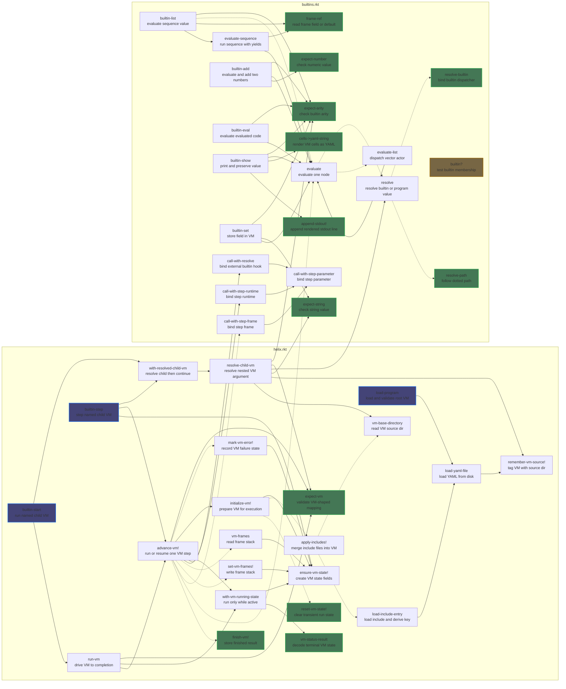

## Overview

The Helix programming system is mainly inspired by Smalltalk and defines a language where the primitive runtime unit is a cell. Cells are analogous to Lisp nodes: larger program structures are composed of many cells rather than collapsing into one indivisible runtime object. There are no distinct runtime categories such as function, environment, object, or VM. Instead, these roles emerge from how cells are connected and how composite structures behave.

The program is therefore a rooted graph of cells. At the top level it may appear as one YAML object, but semantically that object is a composite built from many constituent cells. Execution begins by locating a `"main"` entrypoint within that graph. From that point forward, all computation proceeds through two operations:

- `find(vm, key)` performs name resolution relative to a given execution context.
- `eval(vm)` executes a cell within that same context.

The crucial simplification is that the environment and the VM are identical at the level of the cell graph. There is no separate environment object standing apart from execution state. Lexical scope, dynamic scope, and runtime state all live in the same composed structure.

## Name Resolution

Name resolution is purely structural.

- A cell may contain arbitrary keys.
- If a key is not found locally, `find` follows a `"parent"` reference recursively.
- Any cell can serve as a scope simply by participating in this delegation chain.

This creates a prototype-like structure that simultaneously models lexical scope and inheritance. No special environment object exists apart from the graph being traversed. Because `find` is the only retrieval mechanism, it becomes the backbone of symbolic reference.

Strings are therefore not merely primitive values. A `StrCell` can act as a symbolic reference: when evaluated, it resolves its contents through `find`. This removes the need for a separate symbol type and keeps the surface representation aligned with runtime behavior.

## Evaluation Model

Evaluation is driven by polymorphism on cell type. There is no global interpreter loop that distinguishes expressions from values. Instead, each cell defines how it evaluates itself.

`VecCell` encodes structured computation using a Lisp-like rule:

- the first element is treated as the actor
- the remaining elements are treated as arguments

However, arguments are not passed explicitly through ordinary host-language function parameters. Instead, they are mediated through VM state. The `eval(vm)` method of each cell reads from and writes to the executing VM, typically through a `"state"` field accessible via `find`.

This means each executable cell is best understood as a rule for transforming VM state. Builtins in particular do not receive a detached argument environment and return a separate updated machine. They operate on the executing VM directly and therefore behave like functions from VM state to VM state, with the transition expressed implicitly through in-place mutation of the current composite VM structure.

Stacks and frames may still appear as internal conventions inside `"state"`, but they are implementation details of how a particular cell organizes execution, not the primary abstraction of the language.

The separation between the two primitive operations is intentional:

- `find` is observational and traverses structure
- `eval` is effectful and mutates execution state

## Calling Convention And State

The absence of explicit argument passing has important consequences.

- There is no fixed calling convention at the interface level.
- Different cells may interpret VM state differently.
- Conventions about local state layout are runtime agreements rather than static type rules.

This gives the system flexibility. One cell may organize its local state around a stack discipline, while another may use named fields, frame-like records, or some other structure under `"state"`. The tradeoff is that data flow becomes more implicit, so evaluation discipline must be maintained by convention. The important constant is not a specific stack protocol, but the fact that evaluation proceeds by reading and updating the current VM.

## Nested Execution

Any cell can act as a micro-VM.

If a cell defines a `"state"` field and implements `eval` in terms of that state, it can host its own execution process. That supports:

- nested interpreters
- coroutines
- isolated execution contexts

Because `find` always operates relative to the current VM, switching execution contexts is as simple as changing which cell is passed as `vm`. Execution is therefore distributed across cells that locally manage their own semantics rather than centralized in one fixed interpreter object.

## Error And Return Semantics

Error handling is integrated into the object model. Errors are represented as cells rather than host-language exceptions or unrelated out-of-band mechanisms. When an operation fails, it produces an error cell, and subsequent `find` or `eval` operations propagate that failure through ordinary cell behavior.

`return` introduces a different problem. A returned value is ordinary data, but the act of returning is not. If `return` were modeled as just another normal result of `eval`, then every caller of `eval` would need to inspect the result to determine whether evaluation produced data or a non-local control transfer. That would force control-flow checks into:

- every sequencing site
- every builtin that evaluates subexpressions
- every future evaluator helper

This would spread one control concern across the entire runtime and weaken the intended uniformity of the `find`/`eval` model.

The planned solution is to introduce a `Signal` parent cell type for non-local control outcomes, with `Error` and `Return` as sibling signal cells.

- `Signal` keeps control outcomes within the cell model.
- `Error` represents failure.
- `Return` represents successful non-local transfer.

This keeps the representation Smalltalk-like and inspectable while preserving proper control behavior. The runtime will distinguish between:

- a signal cell as an object
- an actively signaled condition in VM state

A `Return` cell may therefore exist as structured data, but when `return` is evaluated in control position it activates a return signal in VM state. Evaluation then unwinds until the appropriate function boundary consumes that signal, just as an active error signal propagates until it is handled or reaches the top level.

This separation is necessary for two reasons:

- Reification: cells are the only runtime entities, so errors and returns must be representable and inspectable as cells.
- Non-local transfer: `return` is not merely a value constructor; it is a request to terminate the current evaluation path.

The `Signal` family solves both requirements without forcing every builtin and every caller of `eval` to thread control-flow tags through ordinary value flow.

## Surface Syntax

The system’s cell-based representation aligns naturally with YAML as the surface syntax.

- a YAML mapping becomes a composite mapping structure made of cells
- a YAML sequence becomes a composite vector structure made of cells
- individual mapping entries, sequence elements, and strings are represented by cells
- a string becomes a `StrCell` that may resolve symbolically

This removes the need for a custom parser and keeps the syntax close to the runtime representation. Programs can be written directly as YAML documents, and the parsed structure already mirrors the underlying graph of cells rather than requiring a separate surface-language AST.

## Conceptual Lineage

Conceptually, the system sits at the intersection of several traditions:

- prototype-based object systems, through delegation via `"parent"`
- Lisp-style evaluation, through structured data representing computation
- stateful virtual machines, through implicit argument passing and VM-driven execution

Helix does not fully adopt any one of these paradigms. Instead, it extracts their minimal operational principles and recombines them into a uniform model centered on cells, `find`, and `eval`.

## Codebase overview

The diagram below shows the current repository-level invocation graph. Solid edges are unconditional calls in the relevant control path; dotted edges are branch-dependent or optional calls. Root and leaf highlighting is computed within the repository function graph, not including top-level forms or library calls.

## Responsibility matrix

This matrix is intentionally selective. It captures the dominant responsibilities rather than every helper edge.

| Func | Includes | Path | Eval | Steps | Child VM Ctrl |
| --- | --- | --- | --- | --- | --- |
| `apply-includes!`         | x |   |   |   |   |
| `initialize-vm!`          | x |   |   |   |   |
| `resolve-path`            |   | x |   |   |   |
| `resolve`                 |   | x | x |   |   |
| `call-with-resolve`       |   | x |   | x |   |
| `evaluate`                |   |   | x |   |   |
| `evaluate-list`           |   |   | x |   |   |
| `advance-vm!`             |   |   | x | x |   |
| `run-vm`                  |   |   |   | x |   |
| `resolve-child-vm`        |   | x |   |   | x |
| `builtin-start`           |   |   |   | x | x |
| `builtin-step`            |   |   |   | x | x |
| `evaluate-sequence`       |   |   | x | x |   |
| `builtin-eval`            |   |   | x |   |   |
| `builtin-list`            |   |   | x | x |   |
