# C++ Invocation Graph

This document describes the current execution-facing native C++ call graph.

Notes:

- The graph covers the evaluator and directly used runtime helpers.
- Anything in or through `src/ryml_interface.cpp` is intentionally excluded.
- Compiler-defaulted special members are omitted.
- `src/builtins.cpp` and `src/utils.cpp` are not shown because they currently define no functions.

```mermaid
flowchart TD
  classDef entry fill:#447,stroke:#1f6feb,stroke-width:2px;
  classDef leaf fill:#475,stroke:#2da44e,stroke-width:2px;

  subgraph H["src/helix.cpp"]
    h_main["main<br/>run program and print final YAML"]
    h_run_main["run_main<br/>execute top-level main and attach state"]
    h_make_state["make_finished_state<br/>construct finished VM state map"]
    h_set_field["set_map_field<br/>write map field and attach parent"]
    h_attach_parent["attach_parent_if_missing<br/>attach structural parent once"]

    h_eval_cell["evaluate_cell<br/>evaluate one cell recursively"]
    h_eval_resolved["evaluate_resolved_cell<br/>follow resolved references"]
    h_eval_form["evaluate_form<br/>validate vector actor and dispatch"]
    h_eval_builtin["evaluate_builtin_form<br/>route builtin by name"]
    h_eval_show["evaluate_show_form<br/>print one evaluated argument"]
    h_eval_add["evaluate_add_form<br/>sum two integer arguments"]
    h_eval_set["evaluate_set_form<br/>assign top-level binding"]
    h_eval_arg["evaluate_argument<br/>evaluate child and propagate errors"]
    h_expect_arity["expect_form_arity<br/>check builtin argument count"]
    h_expect_int["expect_int_cell<br/>require integer operand"]
    h_make_error["make_error_cell<br/>construct ErrCell"]

    h_lookup_context["lookup_name_from_context<br/>search local then parent scopes"]
    h_enclosing_map["enclosing_map<br/>walk upward to enclosing map"]
    h_lookup_name_map["lookup_name_in_map<br/>exact then dotted lookup in one map"]
    h_lookup_dotted["lookup_dotted_name_from<br/>walk dotted path recursively"]
    h_lookup_child["lookup_map_child<br/>lookup one map field"]

    h_is_null["is_null_cell<br/>treat string null as null main"]
    h_is_error["is_error_cell<br/>recognize ErrCell"]
    h_render_show["render_show_output<br/>render show result text"]

    h_clear_parents["clear_parent_links<br/>remove parent links before exit"]
    h_clear_map["clear_map_parent_links<br/>clear map children parents"]
    h_clear_vec["clear_vec_parent_links<br/>clear vector children parents"]
    h_clear_signal["clear_signal_parent_links<br/>clear signal payload parent"]
    h_clear_child["clear_child_parent_link<br/>clear one child then recurse"]
  end

  subgraph C["src/core.cpp"]
    c_map_ctor["MapCell::MapCell()<br/>construct empty map cell"]
    c_vec_ctor["VecCell::VecCell()<br/>construct empty vector cell"]
    c_int_ctor["IntCell::IntCell<br/>construct integer cell"]
    c_str_ctor["StrCell::StrCell(value)<br/>construct string cell"]
    c_err_ctor["ErrCell::ErrCell<br/>construct error signal cell"]
    c_signal_check["SigCell::is_signal<br/>report signal kind"]
  end

  h_main --> h_run_main
  h_main --> h_clear_parents

  h_run_main --> h_is_null
  h_run_main --> h_eval_cell
  h_run_main --> h_make_state
  h_run_main --> h_set_field
  h_run_main --> h_make_error

  h_make_state --> c_map_ctor
  h_make_state --> h_set_field
  h_make_state --> c_str_ctor
  h_make_state --> c_vec_ctor

  h_set_field --> h_attach_parent

  h_eval_cell --> h_eval_form
  h_eval_cell --> h_lookup_context
  h_eval_cell --> h_eval_resolved

  h_eval_resolved --> h_eval_cell

  h_eval_form --> h_make_error
  h_eval_form --> h_eval_builtin

  h_eval_builtin --> h_eval_show
  h_eval_builtin --> h_eval_add
  h_eval_builtin --> h_eval_set
  h_eval_builtin --> h_make_error

  h_eval_show --> h_expect_arity
  h_eval_show --> h_eval_arg
  h_eval_show --> h_is_error
  h_eval_show --> h_render_show

  h_eval_add --> h_expect_arity
  h_eval_add --> h_eval_arg
  h_eval_add --> h_expect_int
  h_eval_add --> h_is_error
  h_eval_add --> c_int_ctor

  h_eval_set --> h_expect_arity
  h_eval_set --> h_eval_arg
  h_eval_set --> h_is_error
  h_eval_set --> h_make_error
  h_eval_set --> h_set_field

  h_eval_arg --> h_eval_cell
  h_eval_arg --> h_is_error

  h_expect_arity --> h_make_error
  h_expect_int --> h_is_error
  h_expect_int --> h_make_error
  h_make_error --> c_err_ctor

  h_lookup_context --> h_enclosing_map
  h_lookup_context --> h_lookup_name_map

  h_lookup_name_map --> h_lookup_child
  h_lookup_name_map --> h_lookup_dotted
  h_lookup_dotted --> h_lookup_child
  h_lookup_dotted --> h_lookup_dotted

  h_render_show --> c_signal_check
  h_clear_parents --> c_signal_check
  h_clear_parents --> h_clear_map
  h_clear_parents --> h_clear_vec
  h_clear_parents --> h_clear_signal
  h_clear_map --> h_clear_child
  h_clear_vec --> h_clear_child
  h_clear_signal --> h_clear_child
  h_clear_child --> h_clear_parents

  class h_main entry;
  class h_attach_parent,h_is_null,h_is_error,h_lookup_child,h_enclosing_map,c_map_ctor,c_vec_ctor,c_int_ctor,c_str_ctor,c_err_ctor,c_signal_check leaf;
```

