# C++ Invocation Graph

This document describes the current execution-facing native C++ call graph.

Notes:

- The graph covers the host evaluator, builtins, VM stepping, and directly used runtime helpers.
- Anything in or through `src/ryml_interface.cpp` is intentionally excluded, including include-time native module loading.
- The broken-out SFML native module is intentionally excluded. `src/sfmlwrapper.cpp` builds as `build/sfml.so` and is loaded through YAML `include`; it is not part of the host runtime graph.
- Compiler-defaulted special members are omitted.
- `src/utils.cpp` is not shown because it currently defines no functions.

```mermaid
flowchart LR
  classDef entry fill:#447,stroke:#1f6feb,stroke-width:2px;
  classDef leaf fill:#475,stroke:#2da44e,stroke-width:2px;
  classDef recurse fill:#664,stroke:#d29922,stroke-width:2px;
  classDef runtime stroke:#ff5c8a,stroke-width:2px;

  h_main["src/helix.cpp::main<br/>load, run, emit"]
  h_run_main["src/helix.cpp::run_main<br/>run VM to terminal state"]
  h_run_vm["src/helix.cpp::run_vm<br/>advance until terminal"]
  h_advance_vm["src/helix.cpp::advance_vm<br/>start or resume VM"]
  h_start_main["src/helix.cpp::start_vm_main<br/>evaluate main entrypoint"]
  h_resume_frame["src/helix.cpp::resume_vm_frame<br/>dispatch current frame"]
  h_advance_list["src/helix.cpp::advance_list_frame<br/>resume list frame"]
  h_store_frame["src/helix.cpp::store_list_resume_frame<br/>store list continuation"]
  h_retire_frame["src/helix.cpp::retire_unyielded_frame<br/>clear completed frame"]
  h_current_frame["src/helix.cpp::current_frame<br/>read active frame"]
  h_frame_values["src/helix.cpp::frame_values<br/>read frame sequence"]
  h_frame_index["src/helix.cpp::frame_index<br/>read frame index"]
  h_frame_name["src/helix.cpp::current_frame_name<br/>read frame name"]
  h_eval_cell["src/helix.cpp::evaluate_cell<br/>evaluate one cell"]
  h_eval_form["src/helix.cpp::evaluate_form<br/>evaluate actor and call"]
  h_resolve_cell["src/helix.cpp::resolve_cell<br/>resolve one cell without eval"]
  h_render_show["src/helix.cpp::render_show_output<br/>render show output"]
  h_is_null["src/helix.cpp::is_null_cell<br/>detect nil"]
  h_fail_vm["src/helix.cpp::fail_vm<br/>attach VM error state"]
  h_lookup_context["src/helix.cpp::lookup_context<br/>choose lookup owner"]
  h_resolution_details["src/helix.cpp::make_resolution_details<br/>build default error data"]
  h_attach_error_source["src/helix.cpp::attach_error_source<br/>extend map-like error data"]

  b_init["src/builtins.cpp::initialize_builtins<br/>install evaluator callbacks"]
  b_make_zygote["src/builtins.cpp::make_zygote<br/>construct builtin root"]
  b_install["src/builtins.cpp::install_builtin<br/>insert FunCell builtin"]
  b_apply_callback["src/builtins.cpp::apply_vm_callback_or_signal<br/>call runtime callback"]
  b_show["src/builtins.cpp::builtin_show<br/>show builtin"]
  b_add["src/builtins.cpp::builtin_add<br/>add builtin"]
  b_int_binary["src/builtins.cpp::builtin_int_binary<br/>shared integer binary builtin"]
  b_div["src/builtins.cpp::builtin_div<br/>division builtin"]
  b_mod["src/builtins.cpp::builtin_mod<br/>modulo builtin"]
  b_set["src/builtins.cpp::builtin_set<br/>set builtin"]
  b_builtin_eval["src/builtins.cpp::builtin_eval<br/>evaluate resolved code"]
  b_list["src/builtins.cpp::builtin_list<br/>run sequence vector"]
  b_append["src/builtins.cpp::builtin_append<br/>append vector element"]
  b_pop["src/builtins.cpp::builtin_pop<br/>pop vector element"]
  b_at["src/builtins.cpp::builtin_at<br/>read vector element"]
  b_copy["src/builtins.cpp::builtin_copy<br/>copy resolved value"]
  b_if["src/builtins.cpp::builtin_if<br/>conditional branch"]
  b_while["src/builtins.cpp::builtin_while<br/>loop while truthy"]
  b_start["src/builtins.cpp::builtin_start<br/>run child VM"]
  b_step["src/builtins.cpp::builtin_step<br/>step child VM"]
  b_make_error["src/builtins.cpp::make_error<br/>builtin error wrapper"]
  b_eval["src/builtins.cpp::evaluate_or_signal<br/>eval or propagate signal"]
  b_eval_int["src/builtins.cpp::evaluate_int_or_error<br/>eval integer operand"]
  b_resolve["src/builtins.cpp::resolve_or_signal<br/>resolve or propagate signal"]
  b_resolve_vec["src/builtins.cpp::resolve_vec_or_signal<br/>resolve vector value"]
  b_resolve_vec_target["src/builtins.cpp::resolve_vec_target_or_signal<br/>resolve vector target"]
  b_vec_callback["src/builtins.cpp::vec_or_signal_from_callback<br/>callback vector check"]
  b_resolve_child_vm["src/builtins.cpp::resolve_child_vm<br/>resolve child VM name"]
  b_truthy["src/builtins.cpp::is_truthy<br/>truthiness check"]

  c_make_error["src/core.cpp::make_error_cell<br/>shared error helper"]
  c_expect_map["src/core.cpp::expect_map_cell<br/>shared map check"]
  c_expect_vm["src/core.cpp::expect_vm_cell<br/>shared VM check"]
  c_make_state["src/core.cpp::make_finished_state_cell<br/>build finished state"]
  c_attach_state["src/core.cpp::attach_finished_state<br/>attach finished state"]
  c_attach_terminal["src/core.cpp::attach_terminal_state<br/>attach terminal state"]
  c_ensure_state["src/core.cpp::ensure_vm_state<br/>ensure VM state map"]
  c_vm_status["src/core.cpp::vm_status<br/>read VM status"]
  c_vm_status_cell["src/core.cpp::vm_status_cell<br/>read status cell"]
  c_vm_frames["src/core.cpp::vm_frames<br/>read VM frames"]
  c_set_vm_status["src/core.cpp::set_vm_status<br/>write VM status"]
  c_clear_terminal["src/core.cpp::clear_vm_terminal_fields<br/>clear result/error"]
  c_vm_terminal["src/core.cpp::vm_is_terminal<br/>terminal check"]
  c_vm_result["src/core.cpp::vm_result<br/>read VM result"]
  c_arm_list["src/core.cpp::arm_list_frame<br/>create list frame"]
  c_expect_arity["src/core.cpp::expect_form_arity<br/>shared arity check"]
  c_expect_int["src/core.cpp::expect_int_cell<br/>shared int check"]
  c_map_field_cell["src/core.cpp::map_field_cell<br/>read map field"]
  c_map_field_vec["src/core.cpp::map_field_vec<br/>read vector field"]
  c_map_field_string["src/core.cpp::map_field_string<br/>read string field"]
  c_map_field_int["src/core.cpp::map_field_int<br/>read integer field"]
  c_map_set["src/core.cpp::MapCell::set<br/>attach parent and store child"]
  c_cell_member["src/core.cpp::Cell::lookup_member<br/>default member lookup error"]
  c_map_member["src/core.cpp::MapCell::lookup_member<br/>field lookup"]
  c_scope_lookup["src/core.cpp::ScopeCell::lookup<br/>scope lookup"]
  c_vm_lookup["src/core.cpp::VmCell::lookup<br/>VM lookup"]
  c_lookup_scope["src/core.cpp::lookup_from_scope_like<br/>walk parent scopes"]
  c_lookup_path["src/core.cpp::lookup_path_from_receiver<br/>dotted member lookup"]
  c_lookup_error["src/core.cpp::make_lookup_error<br/>lookup error data"]
  c_fun_call["src/core.cpp::FunCell::call<br/>invoke builtin"]
  c_clear_desc["src/core.cpp::Cell::clear_descendant_parent_links<br/>polymorphic cleanup"]
  c_clear_map["src/core.cpp::MapCell::clear_descendant_parent_links<br/>map cleanup"]
  c_clear_vec["src/core.cpp::VecCell::clear_descendant_parent_links<br/>vector cleanup"]
  c_clear_sig["src/core.cpp::SigCell::clear_descendant_parent_links<br/>signal cleanup"]

  r_eval["evaluate recursion"]
  r_lookup["lookup recursion"]
  r_clear["cleanup recursion"]

  h_main --> b_init
  h_main --> b_make_zygote
  h_main --> h_run_main
  h_main --> c_clear_desc

  h_run_main --> h_run_vm
  h_run_vm --> c_vm_terminal
  h_run_vm --> h_advance_vm
  h_run_vm --> c_vm_result

  h_advance_vm --> c_ensure_state
  h_advance_vm --> c_vm_terminal
  h_advance_vm --> c_vm_frames
  h_advance_vm --> h_start_main
  h_advance_vm --> h_resume_frame
  h_advance_vm --> c_attach_terminal
  h_advance_vm --> c_vm_result

  h_start_main --> h_is_null
  h_start_main --> h_eval_cell
  h_start_main --> c_set_vm_status
  h_start_main --> c_clear_terminal
  h_start_main --> c_attach_terminal
  h_start_main --> h_fail_vm

  h_fail_vm --> c_make_error
  h_fail_vm --> c_attach_terminal

  h_resume_frame --> h_current_frame
  h_resume_frame --> h_frame_name
  h_resume_frame --> h_advance_list
  h_resume_frame --> h_fail_vm

  h_current_frame --> c_vm_frames
  h_frame_name --> c_map_field_string

  h_advance_list --> h_frame_values
  h_advance_list --> h_frame_index
  h_advance_list --> h_eval_cell
  h_advance_list --> h_store_frame
  h_advance_list --> h_retire_frame
  h_advance_list --> h_fail_vm
  h_advance_list --> c_ensure_state
  h_advance_list --> c_attach_terminal
  h_frame_values --> c_map_field_vec
  h_frame_index --> c_map_field_int
  h_store_frame --> c_map_set
  h_store_frame --> c_ensure_state
  h_store_frame --> c_set_vm_status
  h_store_frame --> c_clear_terminal

  c_attach_terminal --> c_make_state
  c_attach_terminal --> c_map_set
  c_attach_terminal --> c_clear_desc
  c_attach_terminal --> c_ensure_state
  c_attach_state --> c_clear_desc
  c_attach_state --> c_make_state
  c_attach_state --> c_map_set
  c_make_state --> c_map_set
  c_ensure_state --> c_map_field_vec
  c_ensure_state --> c_map_field_string
  c_ensure_state --> c_map_set
  c_vm_status --> c_ensure_state
  c_vm_status --> c_map_field_string
  c_vm_status_cell --> c_ensure_state
  c_vm_status_cell --> c_map_field_cell
  c_vm_frames --> c_ensure_state
  c_vm_frames --> c_map_field_vec
  c_set_vm_status --> c_ensure_state
  c_set_vm_status --> c_map_set
  c_clear_terminal --> c_ensure_state
  c_vm_terminal --> c_vm_status
  c_vm_result --> c_ensure_state
  c_vm_result --> c_map_field_cell
  c_arm_list --> c_ensure_state
  c_arm_list --> c_map_set
  c_arm_list --> c_set_vm_status
  c_arm_list --> c_clear_terminal

  h_eval_cell --> h_eval_form
  h_eval_cell --> h_resolve_cell
  h_eval_cell --> r_eval

  h_resolve_cell --> h_lookup_context
  h_resolve_cell --> h_resolution_details
  h_resolve_cell --> h_attach_error_source
  h_resolve_cell --> c_scope_lookup
  h_resolve_cell --> c_vm_lookup
  r_eval --> h_eval_cell

  h_eval_form --> h_eval_cell
  h_eval_form --> c_make_error
  h_eval_form --> c_fun_call

  c_scope_lookup --> c_lookup_scope
  c_vm_lookup --> c_lookup_scope
  c_lookup_scope --> c_lookup_path
  c_lookup_path --> c_map_member
  c_lookup_path --> c_cell_member
  c_lookup_path --> c_lookup_error
  c_lookup_path --> r_lookup
  r_lookup --> c_lookup_path
  c_lookup_error --> c_make_error

  c_clear_map --> r_clear
  c_clear_vec --> r_clear
  c_clear_sig --> r_clear
  r_clear --> c_clear_desc

  b_make_zygote --> b_install
  b_install --> c_map_set

  c_fun_call --> b_show
  c_fun_call --> b_add
  c_fun_call --> b_div
  c_fun_call --> b_mod
  c_fun_call --> b_set
  c_fun_call --> b_builtin_eval
  c_fun_call --> b_list
  c_fun_call --> b_append
  c_fun_call --> b_pop
  c_fun_call --> b_at
  c_fun_call --> b_copy
  c_fun_call --> b_if
  c_fun_call --> b_while
  c_fun_call --> b_start
  c_fun_call --> b_step

  b_show --> c_expect_vm
  b_show --> c_expect_arity
  b_show --> b_eval
  b_show --> h_render_show

  b_add --> b_int_binary
  b_int_binary --> c_expect_vm
  b_int_binary --> c_expect_arity
  b_int_binary --> b_eval_int
  b_eval_int --> b_eval
  b_eval_int --> c_expect_int

  b_div --> c_expect_vm
  b_div --> c_expect_arity
  b_div --> b_eval_int
  b_mod --> c_expect_vm
  b_mod --> c_expect_arity
  b_mod --> b_eval_int

  b_set --> c_expect_vm
  b_set --> c_expect_arity
  b_set --> b_eval
  b_set --> b_make_error
  b_set --> c_map_set
  b_set --> c_vm_lookup
  b_set --> c_expect_map
  b_set --> c_map_field_string

  b_builtin_eval --> c_expect_vm
  b_builtin_eval --> c_expect_arity
  b_builtin_eval --> b_eval

  b_list --> c_expect_vm
  b_list --> c_expect_arity
  b_list --> b_resolve_vec
  b_list --> c_arm_list

  b_append --> c_expect_vm
  b_append --> c_expect_arity
  b_append --> b_resolve_vec_target
  b_append --> b_eval

  b_pop --> c_expect_vm
  b_pop --> c_expect_arity
  b_pop --> b_resolve_vec_target
  b_pop --> b_make_error

  b_at --> c_expect_vm
  b_at --> c_expect_arity
  b_at --> b_resolve_vec_target
  b_at --> b_eval_int
  b_at --> b_make_error

  b_copy --> c_expect_vm
  b_copy --> c_expect_arity
  b_copy --> b_resolve
  b_copy --> c_map_set

  b_if --> c_expect_vm
  b_if --> c_expect_arity
  b_if --> b_eval
  b_if --> b_truthy

  b_while --> c_expect_vm
  b_while --> c_expect_arity
  b_while --> b_resolve_vec
  b_while --> b_eval
  b_while --> b_truthy

  b_start --> b_resolve_child_vm
  b_start --> h_advance_vm
  b_start --> c_vm_terminal

  b_step --> b_resolve_child_vm
  b_step --> h_advance_vm
  b_step --> c_vm_status_cell

  b_resolve_child_vm --> c_expect_vm
  b_resolve_child_vm --> c_expect_arity
  b_resolve_child_vm --> h_resolve_cell
  b_resolve_vec --> b_vec_callback
  b_resolve_vec_target --> b_resolve_vec
  b_vec_callback --> b_apply_callback

  b_make_error --> c_make_error
  b_apply_callback --> h_eval_cell
  b_apply_callback --> h_resolve_cell
  b_eval --> h_eval_cell
  b_resolve --> h_resolve_cell

  class h_main entry;
  class h_is_null,b_init,b_make_error,b_truthy,c_make_error,c_expect_map,c_expect_vm,c_make_state,c_expect_arity,c_expect_int,c_map_set,c_map_field_cell,c_map_field_vec,c_map_field_string,c_map_field_int,c_cell_member,c_map_member leaf;
  class r_eval,r_lookup,r_clear recurse;
  class h_main,h_run_main,h_run_vm,h_advance_vm,h_start_main,h_resume_frame,h_advance_list,h_store_frame,h_retire_frame,h_current_frame,h_frame_values,h_frame_index,h_frame_name,h_eval_cell,h_eval_form,h_resolve_cell,h_render_show,h_fail_vm,h_lookup_context,h_resolution_details,h_attach_error_source,b_make_zygote,b_apply_callback,b_show,b_add,b_int_binary,b_div,b_mod,b_set,b_builtin_eval,b_list,b_append,b_pop,b_at,b_copy,b_if,b_while,b_start,b_step,b_eval,b_eval_int,b_resolve,b_resolve_vec,b_resolve_vec_target,b_vec_callback,b_resolve_child_vm,c_attach_state,c_attach_terminal,c_ensure_state,c_vm_status,c_vm_status_cell,c_vm_frames,c_set_vm_status,c_clear_terminal,c_vm_terminal,c_vm_result,c_arm_list,c_fun_call,c_scope_lookup,c_vm_lookup,c_lookup_scope,c_lookup_path,c_lookup_error,c_clear_desc,c_clear_map,c_clear_vec,c_clear_sig runtime;
```

