# C++ Invocation Graph

This document describes the current execution-facing native C++ call graph.

Notes:

- The graph covers the evaluator and directly used runtime helpers.
- Anything in or through `src/ryml_interface.cpp` is intentionally excluded.
- Compiler-defaulted special members are omitted.
- `src/utils.cpp` is not shown because it currently defines no functions.

```mermaid
flowchart LR
  classDef entry fill:#447,stroke:#1f6feb,stroke-width:2px;
  classDef leaf fill:#475,stroke:#2da44e,stroke-width:2px;
  classDef recurse fill:#664,stroke:#d29922,stroke-width:2px;
  classDef runtime stroke:#ff5c8a,stroke-width:2px;

  h_main["src/helix.cpp::main<br/>load, run, emit"]
  h_run_main["src/helix.cpp::run_main<br/>execute main and attach state"]
  h_eval_cell["src/helix.cpp::evaluate_cell<br/>evaluate one cell"]
  h_eval_resolved["src/helix.cpp::evaluate_resolved_cell<br/>follow resolved alias"]
  h_eval_form["src/helix.cpp::evaluate_form<br/>evaluate actor and call"]
  h_resolve_cell["src/helix.cpp::resolve_cell<br/>resolve one cell without eval"]
  h_render_show["src/helix.cpp::render_show_output<br/>render show output"]
  h_is_null["src/helix.cpp::is_null_cell<br/>detect string null"]
  h_resolve_context["src/helix.cpp::resolve_name_from_context<br/>search local then parent maps"]
  h_resolve_map["src/helix.cpp::resolve_name_in_map<br/>exact or dotted lookup"]

  b_init["src/builtins.cpp::initialize_builtins<br/>install evaluator callbacks"]
  b_make_zygote["src/builtins.cpp::make_zygote<br/>construct builtin root"]
  b_install["src/builtins.cpp::install_builtin<br/>insert FunCell builtin"]
  b_show["src/builtins.cpp::builtin_show<br/>show builtin"]
  b_add["src/builtins.cpp::builtin_add<br/>add builtin"]
  b_set["src/builtins.cpp::builtin_set<br/>set builtin"]
  b_builtin_eval["src/builtins.cpp::builtin_eval<br/>evaluate resolved code"]
  b_list["src/builtins.cpp::builtin_list<br/>run sequence vector"]
  b_make_error["src/builtins.cpp::make_error<br/>builtin error wrapper"]
  b_eval["src/builtins.cpp::evaluate_or_error<br/>eval or propagate error"]
  b_eval_int["src/builtins.cpp::evaluate_int_or_error<br/>eval integer operand"]
  b_resolve["src/builtins.cpp::resolve_or_error<br/>resolve without eval"]

  c_make_error["src/core.cpp::make_error_cell<br/>shared error helper"]
  c_expect_map["src/core.cpp::expect_map_cell<br/>shared map check"]
  c_make_state["src/core.cpp::make_finished_state_cell<br/>build finished state"]
  c_attach_state["src/core.cpp::attach_finished_state<br/>attach finished state"]
  c_expect_arity["src/core.cpp::expect_form_arity<br/>shared arity check"]
  c_expect_int["src/core.cpp::expect_int_cell<br/>shared int check"]
  c_map_set["src/core.cpp::MapCell::set<br/>attach parent and store child"]
  c_fun_call["src/core.cpp::FunCell::call<br/>invoke builtin"]
  c_clear_desc["src/core.cpp::Cell::clear_descendant_parent_links<br/>polymorphic cleanup"]
  c_clear_map["src/core.cpp::MapCell::clear_descendant_parent_links<br/>map cleanup"]
  c_clear_vec["src/core.cpp::VecCell::clear_descendant_parent_links<br/>vector cleanup"]
  c_clear_sig["src/core.cpp::SigCell::clear_descendant_parent_links<br/>signal cleanup"]

  r_eval["evaluate recursion"]
  r_lookup["lookup recursion"]
  r_clear["cleanup recursion"]

  h_main --> b_init
  h_main --> b_make_zygote
  h_main --> h_run_main
  h_main --> c_clear_desc

  h_run_main --> h_is_null
  h_run_main --> h_eval_cell
  h_run_main --> c_attach_state
  h_run_main --> c_make_error

  c_attach_state --> c_make_state
  c_attach_state --> c_map_set
  c_make_state --> c_map_set

  h_eval_cell --> h_eval_form
  h_eval_cell --> h_resolve_cell
  h_eval_cell --> h_eval_resolved

  h_resolve_cell --> h_resolve_context
  h_eval_resolved --> r_eval
  r_eval --> h_eval_cell

  h_eval_form --> h_eval_cell
  h_eval_form --> c_make_error
  h_eval_form --> c_fun_call

  h_resolve_context --> h_resolve_map
  h_resolve_map --> r_lookup
  r_lookup --> h_resolve_map

  c_clear_map --> r_clear
  c_clear_vec --> r_clear
  c_clear_sig --> r_clear
  r_clear --> c_clear_desc

  b_make_zygote --> b_install
  b_install --> c_map_set

  c_fun_call --> b_show
  c_fun_call --> b_add
  c_fun_call --> b_set
  c_fun_call --> b_builtin_eval
  c_fun_call --> b_list

  b_show --> c_expect_map
  b_show --> c_expect_arity
  b_show --> b_eval
  b_show --> h_render_show

  b_add --> c_expect_map
  b_add --> c_expect_arity
  b_add --> b_eval_int
  b_eval_int --> b_eval
  b_eval_int --> c_expect_int

  b_set --> c_expect_map
  b_set --> c_expect_arity
  b_set --> b_eval
  b_set --> b_make_error
  b_set --> c_map_set

  b_builtin_eval --> c_expect_map
  b_builtin_eval --> c_expect_arity
  b_builtin_eval --> b_eval

  b_list --> c_expect_map
  b_list --> c_expect_arity
  b_list --> b_resolve
  b_list --> b_eval

  b_make_error --> c_make_error
  b_eval --> h_eval_cell
  b_resolve --> h_resolve_cell

  class h_main entry;
  class h_is_null,b_init,b_make_error,c_make_error,c_expect_map,c_make_state,c_expect_arity,c_expect_int,c_map_set leaf;
  class r_eval,r_lookup,r_clear recurse;
  class h_main,h_run_main,h_eval_cell,h_eval_resolved,h_eval_form,h_resolve_cell,h_render_show,h_resolve_context,h_resolve_map,b_make_zygote,b_show,b_add,b_set,b_builtin_eval,b_list,b_eval,b_eval_int,b_resolve,c_attach_state,c_fun_call,c_clear_desc,c_clear_map,c_clear_vec,c_clear_sig runtime;
```

