# C++ Invocation Graph

This document describes the currently implemented native C++ call graph.

Notes:

- The graph covers nontrivial implemented functions and methods.
- Compiler-defaulted special members such as copy/move constructors and assignments are omitted.
- `src/builtins.cpp` and `src/utils.cpp` are not shown because they currently define no functions.

```mermaid
flowchart TD
  classDef entry fill:#447,stroke:#1f6feb,stroke-width:2px;
  classDef leaf fill:#475,stroke:#2da44e,stroke-width:2px;

  subgraph H["src/helix.cpp"]
    h_main["main<br/>CLI entry, load, run, emit"]
    h_run_main["run_main<br/>run top-level main form"]
    h_eval_cell["evaluate_cell<br/>evaluate one cell in root VM"]
    h_eval_form["evaluate_form<br/>dispatch builtin vector forms"]
    h_render_show["render_show_output<br/>format printed show output"]
    h_is_null["is_null_cell<br/>detect main: null"]
    h_expect_int["expect_int_cell<br/>require integer operand"]
  end

  subgraph R["src/ryml_interface.cpp"]
    r_load_file["read_yaml_file_text<br/>read YAML source file"]
    r_text_copy["ryml_text_to_string<br/>copy ryml text slice"]
    r_scalar["scalar_cell_from_ryml<br/>scalar to Int/Str cell"]
    r_from_node["cell_from_ryml_node<br/>ryml node to cell tree"]
    r_load_root["load_root_cell_from_yaml_file<br/>parse file to root MapCell"]
    r_write_node["write_cell_to_ryml_node<br/>cell tree to ryml node"]
    r_tree_from["ryml_tree_from_cell<br/>build ryml tree from root cell"]
    r_emit["emit_yaml_from_cell<br/>emit YAML string from cell tree"]
  end

  subgraph C["src/core.cpp"]
    c_cell_type["Cell::Cell(Type)<br/>tag base cell kind"]
    c_cell_signal["Cell::is_signal<br/>default false"]
    c_cell_size["Cell::size<br/>default sentinel size"]
    c_cell_call["Cell::call<br/>default not callable"]

    c_map_ctor0["MapCell::MapCell()<br/>empty map cell"]
    c_map_ctor1["MapCell::MapCell(fields)<br/>map cell with fields"]
    c_map_size["MapCell::size<br/>field count"]

    c_vec_ctor0["VecCell::VecCell()<br/>empty vector cell"]
    c_vec_ctor1["VecCell::VecCell(elements)<br/>vector cell with elements"]
    c_vec_size["VecCell::size<br/>element count"]

    c_int_ctor["IntCell::IntCell<br/>integer scalar cell"]

    c_str_ctor0["StrCell::StrCell()<br/>empty string cell"]
    c_str_ctor1["StrCell::StrCell(value)<br/>string scalar cell"]
    c_str_size["StrCell::size<br/>string length"]

    c_fun_ctor0["FunCell::FunCell()<br/>empty callable cell"]
    c_fun_ctor1["FunCell::FunCell(fn)<br/>callable cell with impl"]
    c_fun_call["FunCell::call<br/>invoke stored implementation"]

    c_sig_ctor0["SigCell::SigCell()<br/>empty signal cell"]
    c_sig_ctor1["SigCell::SigCell(value)<br/>signal cell with payload"]
    c_sig_ctor2["SigCell::SigCell(type,value)<br/>typed signal payload"]
    c_sig_signal["SigCell::is_signal<br/>default true for signals"]

    c_ret_ctor0["RetCell::RetCell()<br/>empty return signal"]
    c_ret_ctor1["RetCell::RetCell(value)<br/>return signal payload"]

    c_err_ctor0["ErrCell::ErrCell()<br/>empty error signal"]
    c_err_ctor1["ErrCell::ErrCell(message,value)<br/>error signal payload"]
  end

  h_main --> r_load_root
  h_main --> h_run_main
  h_main --> r_emit

  h_run_main --> h_is_null
  h_run_main --> h_eval_cell
  h_run_main --> c_map_ctor0
  h_run_main --> c_str_ctor1
  h_run_main --> c_vec_ctor0

  h_eval_cell --> h_eval_form

  h_eval_form --> h_eval_cell
  h_eval_form --> h_render_show
  h_eval_form --> h_expect_int
  h_eval_form --> c_int_ctor

  h_render_show --> r_emit

  r_scalar --> r_text_copy
  r_scalar --> c_int_ctor
  r_scalar --> c_str_ctor1

  r_from_node --> r_text_copy
  r_from_node --> r_scalar
  r_from_node --> r_from_node
  r_from_node --> c_map_ctor1
  r_from_node --> c_vec_ctor1
  r_from_node --> c_str_ctor0

  r_load_root --> r_load_file
  r_load_root --> r_from_node

  r_write_node --> r_write_node

  r_tree_from --> r_write_node
  r_emit --> r_tree_from

  c_map_ctor0 --> c_cell_type
  c_map_ctor1 --> c_cell_type
  c_vec_ctor0 --> c_cell_type
  c_vec_ctor1 --> c_cell_type
  c_int_ctor --> c_cell_type
  c_str_ctor0 --> c_cell_type
  c_str_ctor1 --> c_cell_type
  c_fun_ctor0 --> c_cell_type
  c_fun_ctor1 --> c_cell_type
  c_sig_ctor0 --> c_cell_type
  c_sig_ctor1 --> c_cell_type
  c_sig_ctor2 --> c_cell_type
  c_ret_ctor0 --> c_sig_ctor2
  c_ret_ctor1 --> c_sig_ctor2
  c_err_ctor0 --> c_sig_ctor2
  c_err_ctor1 --> c_sig_ctor2
  c_fun_call --> c_cell_call

  class h_main entry;
  class h_is_null,h_expect_int,r_load_file,r_text_copy,c_cell_signal,c_cell_size,c_map_size,c_vec_size,c_str_size,c_sig_signal leaf;
```

